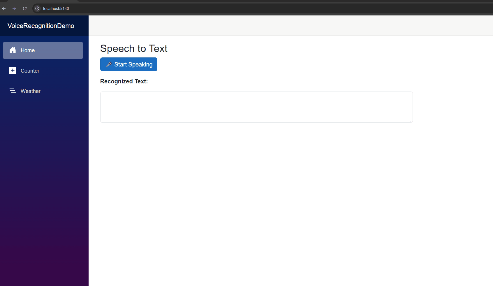

# Building Intelligent Blazor Apps: Part 1 - Speech-to-Text with Web Speech API

In this two-part series, we'll explore how to build modern web applications that can listen to users and intelligently process their input.

**Series Overview:**
- **Part 1** (this article): Implementing speech-to-text functionality using the Web Speech API
- **Part 2** (coming next): Using .NET Smart Components to intelligently fill forms with AI

In this first part, we'll explore how to use speech recognition with the [Web Speech API](https://developer.mozilla.org/en-US/docs/Web/API/Web_Speech_API) to convert spoken words into text within a Blazor WebAssembly application. 

> Web Speech API is a powerful browser-based interface that enables web applications to handle voice data, providing both speech recognition (converting spoken words to text) and speech synthesis (converting text to speech) capabilities. While the API is well-supported in modern browsers like Chrome, Edge, and Firefox, it's worth noting that Safari has limited support through the webkit prefix. 

Let's dive into implementing this functionality in our Blazor application.

## Building Our Speech Recognition Demo

Let's walk through the step-by-step process of creating our voice-enabled Blazor application.

### Step 1: Create a New Blazor WASM (WebAssembly) Project

Start by creating a new Blazor WASM application using the .NET CLI:

```bash
dotnet new blazorwasm -n VoiceRecognitionDemo
```

This command creates a new Blazor WASM project with all the necessary scaffolding and dependencies.

### Step 2: Implementing the Web Speech API Integration

The [Web Speech API](https://developer.mozilla.org/en-US/docs/Web/API/Web_Speech_API) provides powerful speech recognition capabilities directly in the browser. We'll create a JavaScript file to handle the speech recognition functionality and provide a clean interface for our Blazor components.

#### 2a. Speech Recognition Using Web Speech API

First, create a new folder structure for our JavaScript files. In your project's `wwwroot` folder, create a `js` directory and add a new file called `speech-recognition.js`:

```js
window.speechRecognizer = {
    recognition: null,
    startRecognition: function (dotNetObject) {
        const SpeechRecognition = window.SpeechRecognition || window.webkitSpeechRecognition;

        if (!SpeechRecognition) {
            alert("Speech recognition not supported in this browser."); //for Safari
            return;
        }

        const recognition = new SpeechRecognition();
        recognition.lang = 'en-US';
        recognition.interimResults = false;
        recognition.maxAlternatives = 1;

        recognition.onresult = function (event) {
            const text = event.results[0][0].transcript;
            dotNetObject.invokeMethodAsync('OnSpeechRecognized', text);
        };

        recognition.onerror = function (event) {
            console.error("Speech recognition error:", event.error);
        };

        recognition.start();
        window.speechRecognizer.recognition = recognition;
    },
    stopRecognition: function () {
        if (window.speechRecognizer.recognition) {
            window.speechRecognizer.recognition.stop();
        }
    },
    resetRecognition: function () {
        window.speechRecognizer.recognition = null;
    }
};
```

This JavaScript code provides several key features:

- **Browser compatibility detection**: Handles both standard and webkit-prefixed versions of the Speech Recognition API
- **Language configuration**: Set to English (US) by default, but easily configurable
- **Error handling**: Gracefully handles browsers that don't support speech recognition (like Safari)
- **Callback integration**: Uses .NET's JavaScript interop to communicate results back to our Blazor component (`dotNetObject.invokeMethodAsync('OnSpeechRecognized', text);`)

#### 2b. Adding the Script to the Project

Next, we need to include our JavaScript file in the application. Add the following script reference to your `wwwroot/index.html` file, just before the closing `</body>` tag:

```html
<script src="js/speech-recognition.js"></script>
```

### Step 3: Building the Blazor Component

Open the `Home.razor` file and replace its content with the following comprehensive implementation:

```razor
@page "/"
@inject IJSRuntime JS
@implements IDisposable

<h3>Speech to Text</h3>

<div class="row">
    <div class="col">
        @if (!isListening)
        {
            <button @onclick="StartSpeechRecognition" class="btn btn-primary">🎤 Start Speaking</button>
        }
        else
        {
            <button @onclick="StopSpeechRecognition" class="btn btn-danger">🚫 Stop Speaking</button>
        }

        <div class="row mt-3">
            <div class="col">
                <p><strong>Recognized Text:</strong></p>
                <textarea class="form-control" rows="3" readonly>@recognizedText</textarea>
            </div>
        </div>
    </div>
</div>

@code {
    private string recognizedText = "";
    private bool isListening = false;

    private DotNetObjectReference<Home>? objRef;

    protected override void OnInitialized()
    {
        objRef = DotNetObjectReference.Create(this);
    }

    private async Task StartSpeechRecognition()
    {
        await JS.InvokeVoidAsync("speechRecognizer.startRecognition", objRef);
        isListening = true;
    }

    [JSInvokable]
    public Task OnSpeechRecognized(string text)
    {
        recognizedText = text;
        StateHasChanged();
        return Task.CompletedTask;
    }

    public async Task StopSpeechRecognition()
    {
        isListening = false;
        await JS.InvokeVoidAsync("speechRecognizer.stopRecognition");
    }

    public void Dispose()
    {
        objRef?.Dispose();
    }
}
```

Let's break down the key components of our Blazor implementation:

- **State management**: We track the application state using two fields:
  ```csharp
  private string recognizedText = ""; // Stores the converted speech text
  private bool isListening = false;   // Tracks if we're actively listening
  ```

- **JavaScript interop**: We use `IJSRuntime` to call our JavaScript functions:
  ```csharp
  private async Task StartSpeechRecognition()
  {
      await JS.InvokeVoidAsync("speechRecognizer.startRecognition", objRef);
      isListening = true;
  }
  ```

- **Callback handling**: The `[JSInvokable]` attribute enables JavaScript to call back into our code:
  ```csharp
  [JSInvokable]
  public Task OnSpeechRecognized(string text)
  {
      recognizedText = text;
      StateHasChanged();
      return Task.CompletedTask;
  }
  ```

- **Resource cleanup**: We implement `IDisposable` to properly clean up the JavaScript reference:
  ```csharp
  private DotNetObjectReference<Home>? objRef;
  
  public void Dispose()
  {
      objRef?.Dispose();
  }
  ```

- **Reactive UI**: The component automatically updates when speech is recognized:
  ```csharp
  // In OnSpeechRecognized:
  recognizedText = text;      // Update the text
  StateHasChanged();          // Trigger UI refresh
  ```

### Step 4: Testing Your Application

Once you've implemented all the components, run your application:

```bash
dotnet run
```

When you navigate to the application and click the **"🎤 Start Speaking"** button, you'll see the interface change to show a **"🚫 Stop Speaking"** button, indicating that the application is actively listening for your voice input. As you speak, the recognized text will appear in the textarea below the buttons.



The application provides a smooth user experience with clear visual feedback about the current state of speech recognition.

## What's Next?

In Part 2 of this series, we'll enhance our speech recognition implementation with AI capabilities using [.NET Smart Components](https://devblogs.microsoft.com/dotnet/introducing-dotnet-smart-components/). We'll explore how to intelligently parse the recognized speech and automatically fill form fields, creating truly intelligent user interfaces that understand context and intent.

Stay tuned for the next part where we'll transform simple speech-to-text into intelligent form completion!

